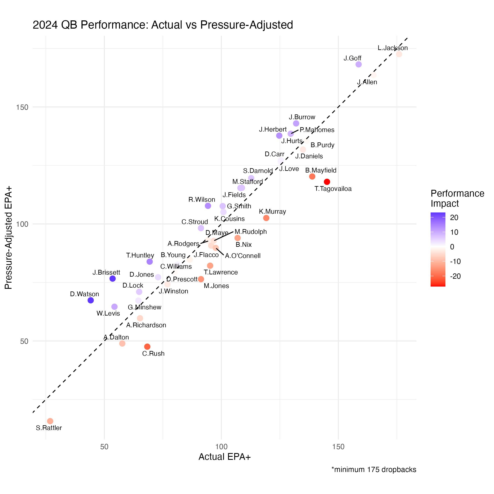

# NFL Pressure-Adjusted QB Statistics

Advanced quarterback analytics that evaluate performance independent of offensive line quality, featuring the novel Pressure-Adjusted EPA metric.

## Problem Statement

Traditional QB statistics can be misleading when comparing players with vastly different protection levels. A quarterback facing pressure on 25% of dropbacks versus 7% operates under fundamentally different conditions, yet standard metrics treat their performances equally.

## Primary Innovation: Pressure-Adjusted EPA

This project's main contribution is **Pressure-Adjusted EPA** - a comprehensive metric that standardizes QB performance to league-average pressure conditions.

### Pressure-Adjusted EPA+

**The core metric for evaluating QB talent independent of protection:**
- Adjusts every QB's performance to the same pressure environment
- Reveals who would excel with average offensive line protection
- Shows which QBs are being helped/hurt by their circumstances
- **Scale**: 100 = league average, 133 = elite (+1 standard deviation)



*QBs above the diagonal line benefit from pressure adjustment (face tougher conditions), while those below are helped by better protection.*

**Key Insights:**
- Some "struggling" QBs are actually above average talents behind poor protection
- Some "elite" QBs benefit significantly from exceptional protection
- Identifies undervalued QBs who excel despite difficult circumstances

**2024 QB Rankings**
| Rank|Player       | Adj EPA+| Actual EPA+|  Gain| Rank +/-|
|----:|:------------|--------:|-----------:|-----:|--------:|
|    1|L.Jackson    |    171.6|       174.7|  -3.2|        0|
|    2|J.Goff       |    167.2|       157.3|   9.8|        1|
|    3|J.Allen      |    162.5|       163.7|  -1.2|       -1|
|    4|J.Burrow     |    141.7|       130.4|  11.3|        5|
|    5|P.Mahomes    |    137.3|       128.1|   9.2|        5|
|    6|J.Herbert    |    136.5|       123.2|  13.3|        7|
|    7|B.Purdy      |    134.2|       134.9|  -0.7|       -1|
|    8|J.Hurts      |    131.5|       131.5|   0.0|        0|
|    9|J.Daniels    |    130.5|       133.4|  -2.9|       -2|
|   10|D.Carr       |    125.8|       123.9|   1.9|        1|
|   11|J.Love       |    125.1|       123.7|   1.4|        1|
|   12|B.Mayfield   |    118.8|       137.4| -18.5|       -7|
|   13|S.Darnold    |    118.1|       111.1|   7.0|        2|
|   14|T.Tagovailoa |    116.5|       143.7| -27.2|      -10|
|   15|M.Stafford   |    113.9|       107.1|   6.8|        1|
|   16|J.Fields     |    113.9|       106.5|   7.4|        1|
|   17|R.Wilson     |    106.2|        92.5|  13.7|       10|
|   18|G.Smith      |    106.1|        98.8|   7.3|        2|
|   19|K.Cousins    |    103.5|        99.2|   4.4|        0|
|   20|K.Murray     |    101.0|       117.6| -16.6|       -6|
|   21|C.Stroud     |     96.6|        89.5|   7.1|        8|
|   22|B.Nix        |     92.3|       105.3| -12.9|       -4|
|   23|D.Maye       |     91.4|        92.5|  -1.1|        3|
|   24|M.Rudolph    |     91.1|        95.0|  -3.8|       -2|
|   25|A.Rodgers    |     91.1|        92.8|  -1.7|        0|
|   26|J.Flacco     |     89.0|        93.9|  -4.8|       -3|
|   27|A.O'Connell  |     88.1|        95.8|  -7.8|       -6|
|   28|B.Young      |     83.0|        84.7|  -1.7|        2|
|   29|C.Williams   |     80.9|        79.4|   1.5|        2|
|   30|T.Lawrence   |     80.4|        93.4| -13.0|       -6|
|   31|D.Prescott   |     77.5|        78.2|  -0.7|        1|
|   32|D.Jones      |     75.4|        71.0|   4.4|        2|
|   33|J.Brissett   |     74.8|        51.5|  23.4|        7|
|   34|M.Jones      |     74.6|        89.5| -14.9|       -6|
|   35|J.Winston    |     72.4|        75.1|  -2.7|       -2|
|   36|D.Lock       |     69.1|        62.9|   6.2|        1|
|   37|D.Watson     |     65.5|        42.0|  23.5|        4|
|   38|G.Minshew    |     65.4|        62.6|   2.8|        0|
|   39|W.Levis      |     62.7|        52.3|  10.5|        0|
|   40|A.Richardson |     57.8|        63.3|  -5.5|       -4|
|   41|C.Rush       |     45.5|        66.4| -20.9|       -6|
|   42|S.Rattler    |     13.4|        24.6| -11.2|        0|

### Supporting Metrics

**Pressure Differential Score** 
- Measures pressure resistance relative to league average
- Validates the Pressure-Adjusted EPA findings

**Decision-Making Under Pressure**
- Separates mental processing from physical execution
- Provides additional context for pressure performance

## Key Findings

- **Protection ≠ Performance**: Some highly-protected QBs perform poorly when protection breaks down
- **Mobile QB Myth**: Mobile QBs don't necessarily face less pressure than pocket passers
- **Pressure Resistance vs. Raw Talent**: Independent evaluation reveals QBs who excel despite circumstances

## Methodology

### Pressure Definition
Due to nflfastR data limitations, pressure is defined as plays where the QB was hit or sacked (≈14% of dropbacks). While this excludes hurries, it captures high-impact pressure situations where protection completely failed.

### Data Sources
- **nflfastR**: Play-by-play data (2018-2024)
- **NextGen Stats**: CPOE and air yards analysis
- **Sample**: QBs with 175+ dropbacks per season

### Validation
Analysis includes CPOE (completion percentage over expected) and air yards to validate EPA findings and understand QB decision-making under pressure.

## Getting Started

Clone the repository and run the analysis pipeline:

```r
# Load required libraries
library(tidyverse)
library(nflreadr)
library(nflfastR)

# Run analysis pipeline
source("scripts/data_collection.R")
source("scripts/core_metrics.R")
source("scripts/visualizations.R")
```

**Note**: Raw data files are not included due to size. Scripts will download current nflfastR data automatically.

## Limitations

- Pressure definition excludes hurries (≈50-60% of total pressure situations)
- Play-level time-to-throw data not available in nflfastR
- Analysis focuses on regular season performance only
- Minimum sample size requirements may exclude some backup QBs

## Applications

- Scouting and player evaluation
- Contract negotiation context
- Identifying undervalued/overvalued QBs in free agency

## License

MIT License - feel free to use for research, analysis, or commercial applications.
